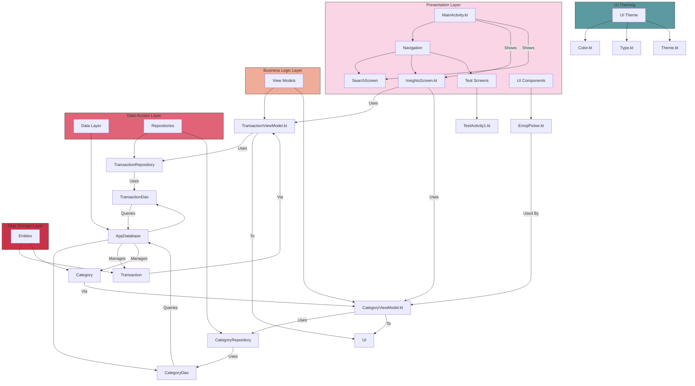

```mermaid
graph TD
    %% Main Application Components
    MainActivity[MainActivity.kt] --> Nav[Navigation]
    Nav --> SearchScreen[SearchScreen]
    Nav --> InsightsScreen[InsightsScreen.kt]
    Nav --> TestScreens[Test Screens]
    
    TestScreens --> TestActivity1[TestActivity1.kt]
    
    %% UI Theme
    UITheme[UI Theme] --> Colors[Color.kt]
    UITheme --> Types[Type.kt]
    UITheme --> Theme[Theme.kt]
    
    %% View Models
    ViewModel[View Models] --> TransactionVM[TransactionViewModel.kt]
    ViewModel --> CategoryVM[CategoryViewModel.kt]
    
    %% Data Layer
    DataLayer[Data Layer] --> AppDB[AppDatabase]
    AppDB --> TransactionDao[TransactionDao]
    AppDB --> CategoryDao[CategoryDao]
    
    %% Repositories
    Repository[Repositories] --> TransactionRepo[TransactionRepository]
    Repository --> CategoryRepo[CategoryRepository]
    
    %% Entities
    Entity[Entities] --> TransactionEntity[Transaction]
    Entity --> CategoryEntity[Category]
    
    %% UI Components
    Components[UI Components] --> EmojiPicker[EmojiPicker.kt]
    
    %% Data Flow
    TransactionVM -- Uses --> TransactionRepo
    CategoryVM -- Uses --> CategoryRepo
    TransactionRepo -- Uses --> TransactionDao
    CategoryRepo -- Uses --> CategoryDao
    TransactionDao -- Queries --> AppDB
    CategoryDao -- Queries --> AppDB
    
    %% Screen Connections
    MainActivity -- Shows --> InsightsScreen
    MainActivity -- Shows --> SearchScreen
    
    %% Component Connections
    InsightsScreen -- Uses --> TransactionVM
    InsightsScreen -- Uses --> CategoryVM
    EmojiPicker -- Used By --> CategoryVM
    
    %% Database Structure
    AppDB -- Manages --> TransactionEntity
    AppDB -- Manages --> CategoryEntity
    
    %% Data Flow
    TransactionEntity -- Via --> TransactionVM -- To --> UI
    CategoryEntity -- Via --> CategoryVM -- To --> UI
    
    %% Architecture Layers
    subgraph PresentationLayer[Presentation Layer]
        MainActivity
        Nav
        SearchScreen
        InsightsScreen
        TestScreens
        Components
    end
    
    subgraph BusinessLogicLayer[Business Logic Layer]
        ViewModel
    end
    
    subgraph DataAccessLayer[Data Access Layer]
        Repository
        DataLayer
    end
    
    subgraph DataStorageLayer[Data Storage Layer]
        Entity
    end
    
    subgraph UITheming[UI Theming]
        UITheme
    end

classDef presentation fill:#f9d5e5,stroke:#333,stroke-width:1px
classDef business fill:#eeac99,stroke:#333,stroke-width:1px
classDef data fill:#e06377,stroke:#333,stroke-width:1px
classDef storage fill:#c83349,stroke:#333,stroke-width:1px
classDef theming fill:#5b9aa0,stroke:#333,stroke-width:1px

class PresentationLayer presentation
class BusinessLogicLayer business
class DataAccessLayer data
class DataStorageLayer storage
class UITheming theming
``` 